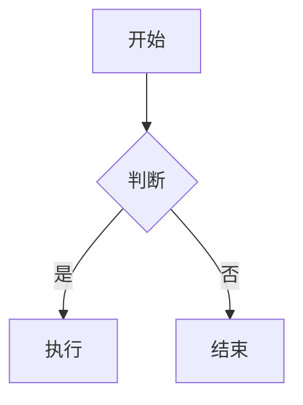

# Markdown 速查表

## 标题

```markdown
# 一级标题
## 二级标题
### 三级标题
#### 四级标题
##### 五级标题
###### 六级标题
```

## 文本样式

```markdown
*斜体* 或 _斜体_
**粗体** 或 __粗体__
***粗斜体*** 或 ___粗斜体___
~~删除线~~
`行内代码`
<u>下划线</u>
```

效果：*斜体* **粗体** ***粗斜体*** ~~删除线~~ `行内代码` <u>下划线</u>

## 列表

### 无序列表

```markdown
- 项目 1
- 项目 2
  - 子项目 2.1
  - 子项目 2.2
* 星号也可以
+ 加号也可以
```

### 有序列表

```markdown
1. 第一项
2. 第二项
   1. 子项 2.1
   2. 子项 2.2
3. 第三项
```

### 任务列表

```markdown
- [x] 已完成任务
- [ ] 未完成任务
- [ ] 待办事项
```

## 链接

```markdown
[文本](https://example.com)
[带标题的链接](https://example.com "标题")
<https://example.com>
[相对路径](docs/readme.md)
[锚点](#标题)
```

## 图片

```markdown


```

## 代码块

````markdown
```python
def hello():
    print("Hello, World!")
```

```sql
SELECT * FROM users WHERE id = 1;
```

```sh
#!/bin/sh
echo "Hello"
```

```json
{"name": "张三", "age": 25}
```

```bash
# 行内可指定语言
```
````

## 表格

```markdown
| 左对齐 | 居中对齐 | 右对齐 |
|:-------|:--------:|-------:|
| 单元格 | 单元格   | 单元格 |
| 文本   | 文本     | 文本   |

| 列1 | 列2 | 列3 |
|-----|-----|-----|
| a   | b   | c   |
```

## 引用

```markdown
> 这是一段引用
> 可以有多行
>
> > 嵌套引用
```

> 效果：这是一段引用

## 水平线

```markdown
---
***
___
```

## 转义字符

```markdown
\* 字面星号
\# 字面井号
\[ 字面方括号
\] 字面方括号
\{ 字面花括号
\} 字面花括号
\_ 字面下划线
```

## 脚注

```markdown
这是带脚注的文本[^1]

[^1]: 这是脚注内容
```

## 定义列表

```markdown
术语
: 定义内容

另一个术语
: 另一个定义
```

## 数学公式（需要渲染器支持）

```markdown
行内公式：$E = mc^2$

块级公式：
$$
\int_{-\infty}^{\infty} e^{-x^2} dx = \sqrt{\pi}
$$
```

## 图表（Mermaid，需要渲染器支持）

````markdown

````

## 常用 HTML 标签

```html
<kbd>Ctrl</kbd> + <kbd>C</kbd>
<br> 换行
<hr> 水平线
<details><summary>折叠内容</summary>隐藏的文本</details>
```

## 快速参考

| 元素 | 语法 |
|------|------|
| 标题 | `# 一级` |
| 粗体 | `**粗体**` |
| 斜体 | `*斜体*` |
| 代码块 | ` ```lang ` |
| 行内代码 | `` `code` `` |
| 链接 | `[文本](url)` |
| 图片 | `` |
| 无序列表 | `- 项目` |
| 有序列表 | `1. 项目` |
| 表格 | `\|列1\|列2\|` |
| 引用 | `> 文本` |
| 水平线 | `---` |
